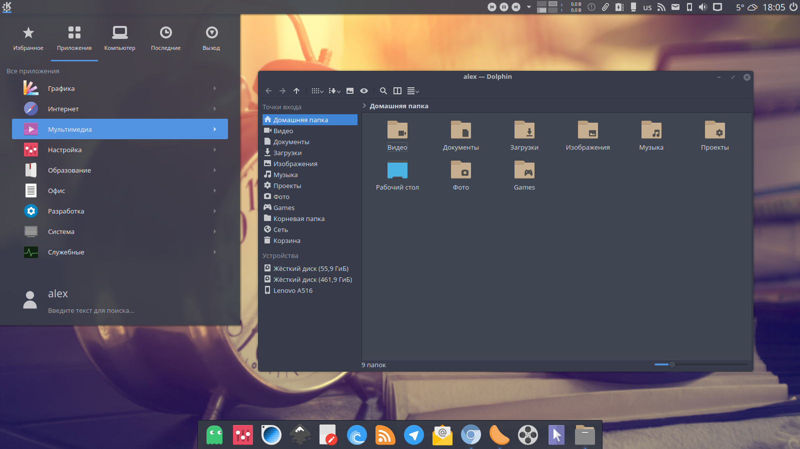
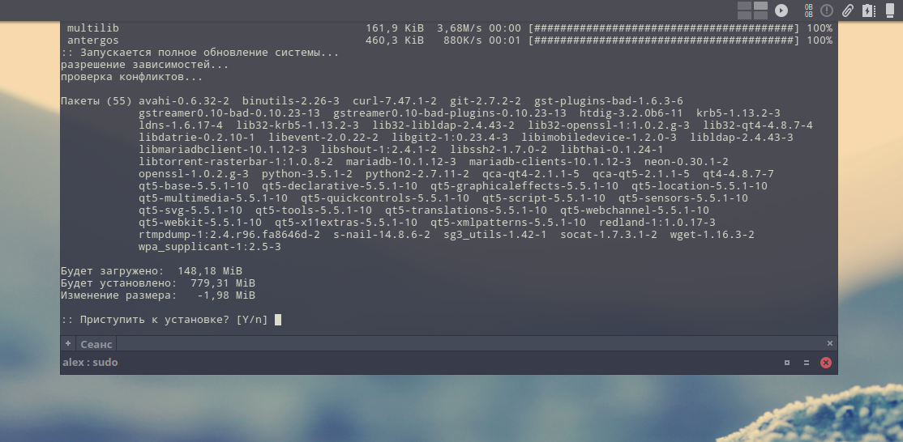

# Arc-Dark-KDE

On repository available:
- Plasma theme
- Aurorae theme
- Color scheme
- Yakuake skin
- Konsole colorscheme
- Chromium theme




# Recommends

[Arc Dark GTK Theme](https://github.com/horst3180/arc-theme)

[Papirus Icon Theme](https://github.com/varlesh/papirus-suite/tree/master/kde-pack/icons)

# Install

**For Archlinux, Manjaro, Netrunner Rolling, Antergos (AUR):**

```
yaourt -S arc-dark-suite-git
```

**For other distros:**

```
git clone https://github.com/varlesh/Arc-Dark-KDE.git
cp -R Arc-Dark-KDE/{aurorae,color-schemes,plasma,konsole,yakuake} ~/.local/share/
```

Big thx **FadeMind** for PKGBUILD :)
