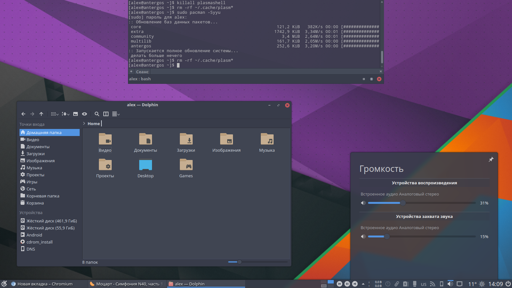

# Arc-Dark-KDE

On repository available:
- Plasma theme
- Aurorae theme
- Color scheme
- Yakuake skin
- Konsole colorscheme




# Recommends

- [Arc Dark GTK Theme](https://github.com/horst3180/arc-theme)

- [Papirus Icon Theme](https://github.com/varlesh/papirus-suite/tree/master/kde-pack/icons)

# Install

**For Archlinux, Manjaro, Netrunner Rolling, Antergos (AUR):**

```
yaourt -S arc-dark-suite-git
```

Big thx [FadeMind](https://github.com/FadeMind) for PKGBUILD :)

**For other distros:**

```
git clone https://github.com/varlesh/Arc-Dark-KDE.git
cp -R Arc-Dark-KDE/{aurorae,color-schemes,plasma,konsole,yakuake} ~/.local/share/
```

# Fix color menubar on GTK2/GTK3
If you use GTK engine for KDE style, you can fix colors for menubar:
```
sudo sed -i 's|2f343f|383c4a|g' /usr/share/themes/Arc-Dark/gtk-2.0/menubar-toolbar/menubar-toolbar-dark.rc
sudo sed -i 's|2f343f|383c4a|g' /usr/share/themes/Arc-Dark/gtk-3.0/gtk.css
sudo mogrify +level-colors "#383c4a" /usr/share/themes/Arc-Dark/gtk-2.0/menubar-toolbar/menubar-dark.png
```

# Extra install

- [Chromium theme](https://github.com/varlesh/Arc-Dark-KDE/tree/master/extra/chromium)
- [Nylas N1 theme](https://github.com/varlesh/Nylas-Arc-Dark-Theme)

# DONATE
If you like my project , you can donate:

<span class="paypal"><a href="https://www.paypal.me/varlesh" title="Donate to this project using Paypal"></a></span>

<span class="Yandex.Money"><a href="http://yasobe.ru/na/varlesh#form_submit" title="Donate to this project using Yandex.Money"></a></span>
